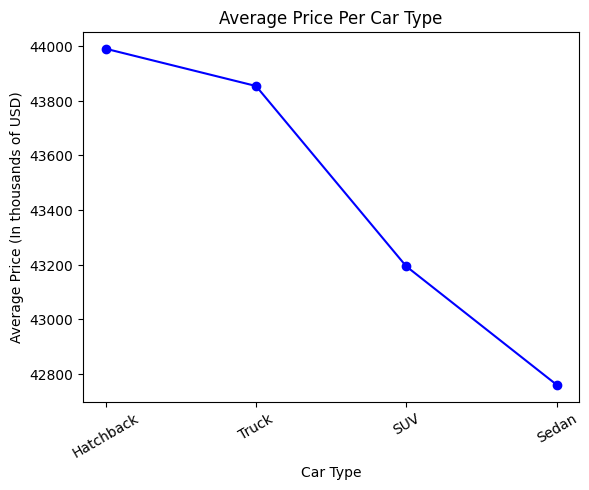
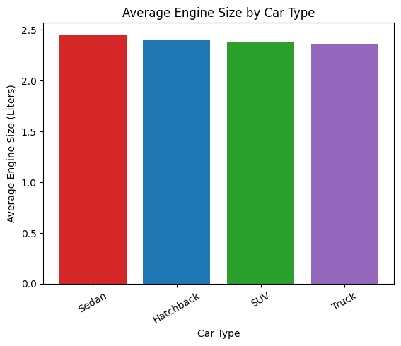

## Repository name
Your repostiory should be named something like `async-final-project-color-name`
Example: `async-final-project-teal-Anas`

## Dataset
[Dataset Name](https://www.kaggle.com/datasets/abdulwadood11220/car-dataset-for-price-prediction-2000-rows)

## Why did I chose this dataset?

 In the future, I plan on saving money to buy a car. I like the way the dataset lists specific attributes of each company, such as the model, type of engine, and its horsepower. Thus, it could be helpful to learn how each car company runs and compare them to others. I can also compare the prices for each company and analyze its market trends.

## Progress
- [ ] Picked dataset
- [ ] Defined 10 questions
- [ ] Answered 10 questions using Pandas
- [ ] Added at least one data visualization (using Matplotlib and/or Seaborn) to each single question
- [ ] Prepared presentation slides to present at graduation

## Questions
- [ ] Question 1: Which car brand has the highest average price?
  - Answer: average_price_per_brand = car_df.groupby("brand")["price"].mean().sort_values(ascending=False)
  - Visualization: 

- [ ] Question 2: Which car type has the highest average price?
  - Answer: [Placeholder for answer]
  - Visualization: 

- [ ] Question 3: What is the average engine size by each car type?
  - Answer: [Placeholder for answer]
  - Visualization: 

- [ ] Question 4: How does the year of the car affect its price?
  - Answer: [Placeholder for answer]
  - Visualization: 

- [ ] Question 5: What is the average price for each Transmission type?
  - Answer: [Placeholder for answer]
  - Visualization: 

- [ ] Question 6: How does the car mileage affects its price?
  - Answer: [Placeholder for answer]
  - Visualization: 

- [ ] Question 7: [Brief description of the task]
  - Answer: [Placeholder for answer]
  - Visualization: 

- [ ] Question 8: [Brief description of the task]
  - Answer: [Placeholder for answer]
  - Visualization: 

- [ ] Question 9: [Brief description of the task]
  - Answer: [Placeholder for answer]
  - Visualization: 

- [ ] Question 10: [Brief description of the task]
  - Answer: [Placeholder for answer]
  - Visualization: 
